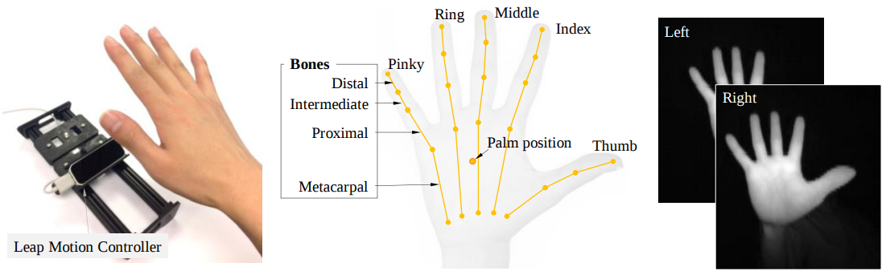
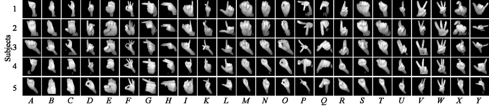

# ASLA-Leap Dataset

**ASLA-Leap** dataset is an American Sign Language Alphabet dataset collected with a Leap Motion Controller. It has 26 signs performed by 5 subjects and 500 samples for each sign.



[Download](https://drive.google.com/file/d/1KwUmCafwUIcE1t9I8eNXU1rFldr8Rxfz/view?usp=sharing) (8.9GB .zip)

## Data Preprocessing

This [notebook](data_prep.ipynb) will show you how to read in the recorded Leap data.

Also, you can find the dataset in `.jpg` and `.csv` files in the [`/dataset`](./dataset) folder, which is more convenient to get started.



## Citation

Please cite our [paper](http://amz.xcdsystem.com/C5AB9227-CA78-AE70-2946FDB80F96639A_abstract_File8390/FinalPaper_1720_0306092921.pdf) in your publications if it helps your research.

```
@article{tao2018asl,
  title = {American Sign Language Alphabet Recognition Using Leap Motion Controller},
  journal = {Proceedings of the 2018 IISE Annual Conference},
  pages = {599-604},
  author = {Wenjin Tao and Ze-Hao Lai and Ming C. Leu and Zhaozheng Yin},
  note = {IISE Annual Conference and Expo 2018},  
  year = {2018}
}
```
If you are interested in this topic, here's another study we did for American Sign Language Alphabet Recognition.

```
@article{tao2018american,
  title={American Sign Language alphabet recognition using Convolutional Neural Networks with multiview augmentation and inference fusion},
  author={Tao, Wenjin and Leu, Ming C and Yin, Zhaozheng},
  journal={Engineering Applications of Artificial Intelligence},
  volume={76},
  pages={202--213},
  year={2018},
  publisher={Elsevier}
}
```

